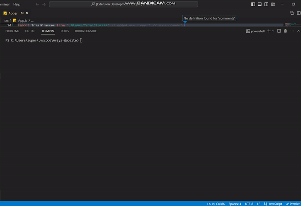

# MMT Extranet Git Commands

This extension combines git commands to avoid mistakes in handling git.

## Commands

The commands are described below:

> MMT: Git Create Commit and Push

<pre><code>
    git add .
    git commit -m your message
    git push origin HEAD:refs/for/your current branch
</code></pre>

> MMT: Git Amend Commit And Push

<pre><code>
    git add .
    git commit --amend
    git push origin HEAD:refs/for/your current branch
</code></pre>

<!-- > MMT: Git Amend Commit With New Message And Push

<pre><code>
    git add .
    git commit --amend -m "your message"
    git push origin HEAD:refs/for/your current branch
</code></pre> -->

> MMT: Git Create MR With **Integration** And Push

<pre><code>
    git checkout integartion
    git reset --hard origin/fb_integration
    git pull --rebase
    git merge origin/your current branch --no-ff --no-commit
    git commit 
    git push origin HEAD:refs/for/fb_integration
</code></pre>

> MMT: Git Create MR With **Release** And Push

<pre><code>
    git checkout integartion
    git reset --hard origin/release
    git pull --rebase
    git merge origin/your current branch --no-ff --no-commit
    git commit 
    git push origin HEAD:refs/for/fb_integration
</code></pre>

<!-- > MMT: Git Create MR With **Existing Branch** And Push

<pre><code>
    git checkout existing branch
    git reset --hard
    git pull --rebase
    git merge origin/your current branch --no-ff --no-commit
    git commit
    git push origin HEAD:refs/for/fb_integration
</code></pre> -->

> MMT: Find Console logs

Run it before staging all the changes.

Finds 'console' word in all the unstaged files. Then open those files in your workspace.

<!-- ## Extension Settings

Include if your extension adds any VS Code settings through the `contributes.configuration` extension point.

For example:

This extension contributes the following settings:

- `myExtension.enable`: Enable/disable this extension.
- `myExtension.thing`: Set to `blah` to do something. -->

## Release Notes

### 0.0.5

Keeping main commands, removing extra features

---

**Open to suggestions and requests**
